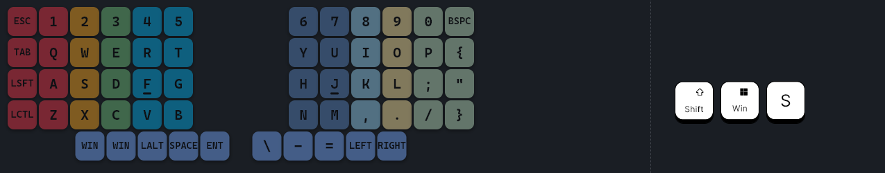

**KEYMAP**

  

**MACROS**

  

`mo1_f14_macro` and `mo2_f15_macro` are used to activate momentary layers as well as send a key down/up event so that it can be used to visualize layers on screen.

  

**BEHAVIOURS**:

  

`lt1_space_macro` and `lt2_space_macro` are used to send Space(configurable) on tap and send the mo1_f14_macro only when the key is actually held. This ensures you don't waste a key position that is more comfortable to reach while still having layer changes on that key.

  

`bspc_del` is a mod-morph to send BACKSPACE by default SHIFT+BACKSPACE sends DELETE.

  

`td_mt` sends CAPSLOCK on a single tap, LSHIFT on a single press and hold, and LCTRL when the tap-dance is pressed twice.

  

**ENCODERS**:

  

Left: Mute + Tab/Shift+Tab 
 - Hold ctrl to move between tabs, alt to move between windows

  

Right: Play/Pause + PageUp/PageDown 
- Hold alt to move to start/end of file (in apps that support it)

  

**NATIVE BUILD COMMANDS:**

  

west build -p -d build/left -b nice_nano_v2 -S studio-rpc-usb-uart -- -DSHIELD=sofle_left -DZMK_EXTRA_MODULES="X:/ZMK/zmk-config-sofle" -DZMK_CONFIG="X:/ZMK/zmk-config-sofle/config"

  

west build -p -d build/right -b nice_nano_v2 -- -DSHIELD=sofle_right -DZMK_EXTRA_MODULES="X:/ZMK/zmk-config-sofle" -DZMK_CONFIG="X:/ZMK/zmk-config-sofle/config"

  

**USEFUL APPS**

  

*ZMK Studio (<https://zmk.studio/>)*

Change your keymap in realtime without having to reflash the firmware everytime. Use the desktop version if you dont want to have to connect a USB cable all the time as it can connect wirelessly unlike the web version. Unfortunately, doesnt support editing all of your keymap the same way Nick Coustos's editor allows. It also writes the changes directly to your firmware so you cant just export your keymap as a file if you wanted to use any other tool that needs it. Use it to figure out a good keymap that is comfortable then remake it once and for all in Nick's editor when you want to modify advanced stuff like macros, encoders, etc.

  

*Keymap Editor (<https://nickcoutsos.github.io/keymap-editor/>)*

  

To directly modify the keymap file that can optionally be written directly back to your github repo. Requires you to flash the rebuilt firmware each time. For realtime editing without flashing use ZMK Studio but that doesn't support macros, encoders, etc.

  

*Keymap Drawer (<https://keymap-drawer.streamlit.app/>)*

  

To generate an image of your keymap like the one seen above that can be setup as a GitHub action that reads your keymap whenever a change is made and will regenerate the image automatically. Can customize a lot of stuff and even get a text(YAML) representation of it for use in OverKeys' userlayout.json

  

*OverKeys (<https://github.com/conventoangelo/OverKeys>)*

  

To create a transparent overlay that matches your keyboard layout as well as visualize layers if you have a key like F14/F15 setup in your firmware to let OverKeys detect layer changes. It also has a touch typing color mode that helps learn which finger to use for each key.

  

*KeyViz (<https://github.com/mulaRahul/keyviz/>)*

  

To show which individual keys were pressed in some corner of your screen, useful to have when you may be accidentally triggering a modifier key but are thinking you hit some other key.

  
Screenshot of OverKeys and KeyViz in action:
